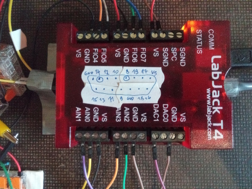
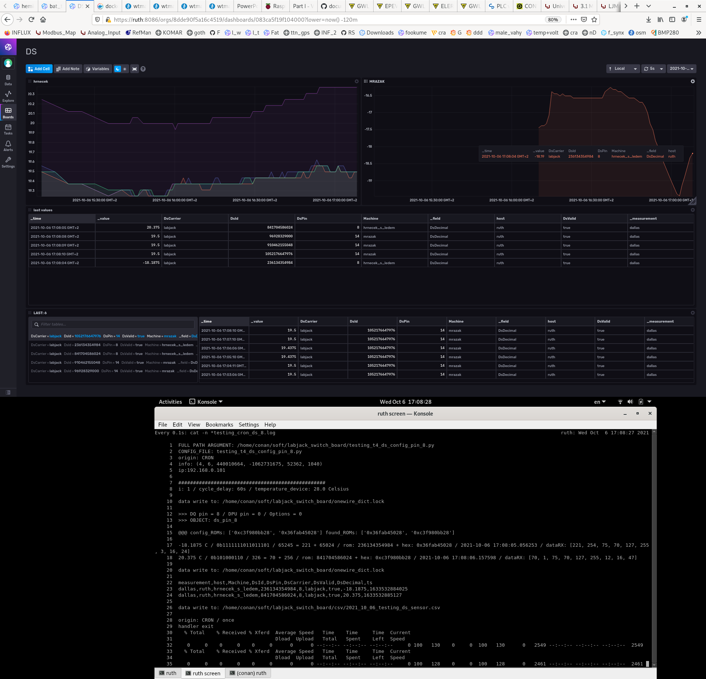
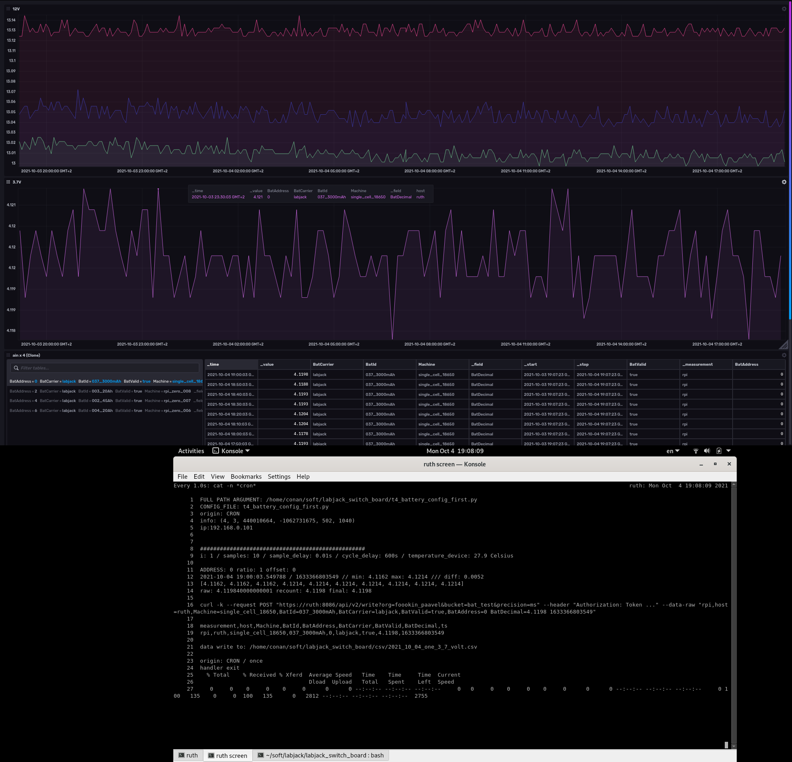
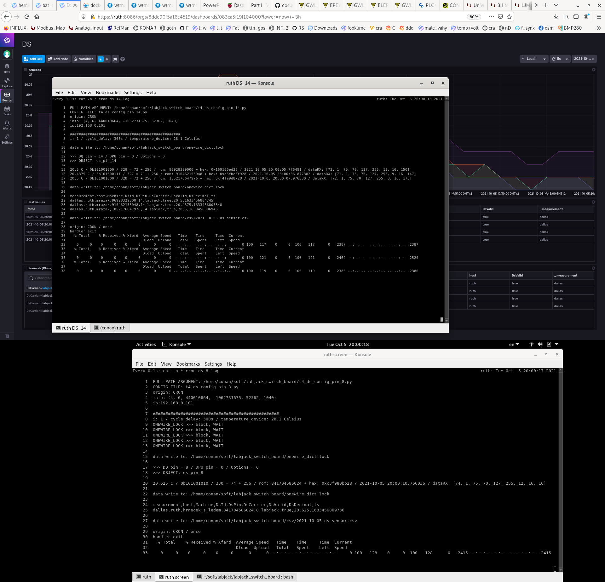

**labjack_switch_board:: [T4](https://labjack.com/products/t4)**
* analog input: battery voltage
* digital input: one wire dallas temperature sensors + watchdog_observer (no race conditions)
* not yet - wheatstone bridge


MACHINE:
 - [LJM installer](https://labjack.com/support/software/installers/ljm)
 - ```$tar -zvxf labjack_ljm_software_2019_07_16_x86_64.tar.gz```
 - ```#./labjack_ljm_installer.run```
 - ```$whereis labjack_kipling``` labjack_kipling: /usr/local/bin/labjack_kipling
 - 
 - [LJM python](https://labjack.com/support/software/examples/ljm/python)
 - ```#pip3 install labjack-ljm```
 - ```#pip3 show labjack-ljm```
 -
 - [ain](https://labjack.com/support/datasheets/t-series/ain) -> [input cheat sheet](https://github.com/srbpavel/labjack_switch_board/blob/main/pic/t4_io_001.png)
 - [db15](https://labjack.com/support/datasheets/t-series/db15)
 - [digital-io / flexible-io](https://labjack.com/support/datasheets/t-series/digital-io/flexible-io)
 -
 - [digital-io / one_wire](https://labjack.com/support/datasheets/t-series/digital-io/1-wire)
 - [app_notes / one_wire](https://labjack.com/support/app-notes/1-wire)
 -
 - [tutorial: Data acquisition and automation with LabJack](https://techexplorations.com/so/labjack/)
 -
 - [labjack/ljm](https://github.com/labjack/labjack-ljm-python/blob/master/labjack/ljm/ljm.py)
 - [labjack/constants](https://github.com/labjack/labjack-ljm-python/blob/master/labjack/ljm/constants.py)
 - [one_wire](https://github.com/labjack/labjack-ljm-python/blob/master/Examples/More/1-Wire/1_wire.py)
 - [DS18B20](https://www.maximintegrated.com/en/products/sensors/DS18B20.html?intcid=para) -> [pdf](https://datasheets.maximintegrated.com/en/ds/DS18B20.pdf)





TODO:
 - dodelat taky jako service + sig_term pro ljm.close(handler) at to nekilluju na hulvata
 - otestovat influx schema na rpi_zero fotopastech
 - zaroven zapisovat battery 12v/5v data z rpi camera vystupu do jinyho measurementu (ale asi jiny repo?)
 - otestovat import z backup csv
 - zjistit proc me nejede CLI po docker restartu


DONE:
 - negative temperature
 - ONEWIRE_LOCK nestaci obcas se to proste potka, takze hlidam jestli sedej ROM's z configu s nalezenejma, jeste se nad tim zamyslet
 - async mereni ruznych portu / ale pres ONEWIRE_LOCK file protoze T4 je potreba hlidat pro nastaveni sbernice/pin jinak meri co nechce
 - DS hledani vice ROM
 - DS pro vice pinu
 - 1-wire ds teplomery rozmakat 
 - util pro sdilenou cast
 - terminal: sleep [forever] / cron: open|close [once]
 - demo config to test code with no hw available 
 - `$python3 t4_battery.py --config t4_battery_config_demo.py`
 - various config for multi read
 - git / config / csv + influx 


CRON:

```
*/10 * * * * /usr/bin/python3 /home/conan/soft/labjack_switch_board/t4_battery.py --config /home/conan/soft/labjack_switch_board/t4_battery_config_first.py 1>/home/conan/soft/labjack_switch_board/1_cron_first.log 2>/home/conan/soft/labjack_switch_board/2_cron_first.log
```

ONEWIRE_LOCK:
```
$watch -n0.1 'cat -n onewire_dict.lock'
$python3 -i t4_ds.py --config t4_ds_config_pin_8.py
$python3 -i t4_ds.py --config t4_ds_config_pin_14.py
```


 * positive temperature


 * negative temperature


 * battery


 * 2x CRON job's at the same time, dqPIN 8 waitting for pin 14 to finish and free T4

